# Generative DeepSDF: Enhancing Implicit Shape Representation through Latent Vector Quantization

**NTU MSAI — AI6131-3D Deep Learning Final Project**

This project proposes **Generative DeepSDF**, which integrates a Vector Quantization (VQ) bottleneck into the DeepSDF architecture to discretize the latent manifold into a learned codebook of geometric features. A lightweight Autoregressive (AR) Transformer prior is then trained to model the distribution of these discrete sequences, enabling novel 3D shape synthesis from a compact implicit representation.

The framework is evaluated on a ShapeNet subset of three categories — **Chair**, **Table**, and **Airplane** (50 objects each) — demonstrating that the VQ bottleneck preserves reconstruction fidelity while significantly improving latent space clustering, and that the AR prior outperforms baseline continuous sampling in generative quality.

## Results

### Data Preprocessing

Point clouds with SDF labels are sampled near each mesh surface and in free space. The figure below shows a sample preprocessing output for the Chair category.

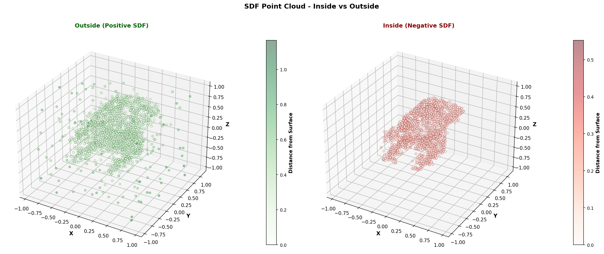

### Reconstruction Fidelity

The VQ bottleneck introduces only a marginal reduction in reconstruction accuracy compared to the continuous baseline, while providing a structured discrete latent space.

| Model | Chamfer Distance ↓ | Earth Mover's Distance ↓ |
|---|---|---|
| **Baseline DeepSDF** | **0.1288** | **0.1431** |
| Generative DeepSDF | 0.1396 | 0.1474 |

| Ground Truth | Baseline DeepSDF | Generative DeepSDF |
|:---:|:---:|:---:|
| 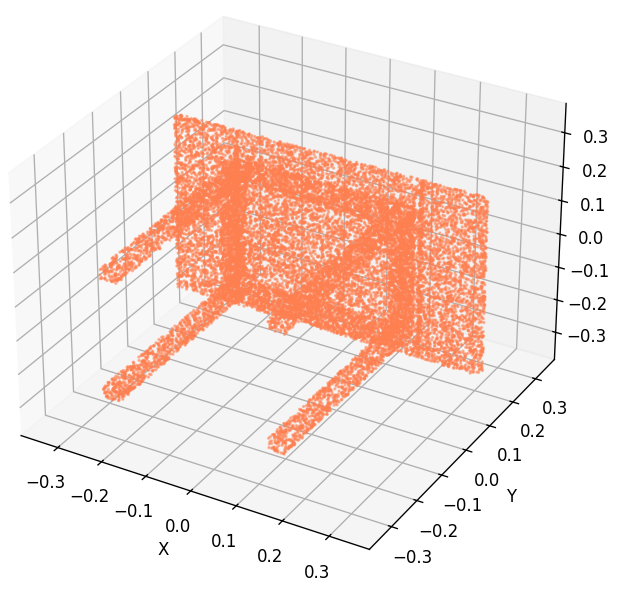 | 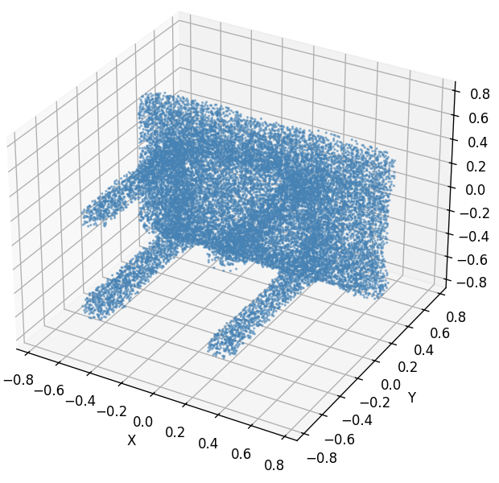 | 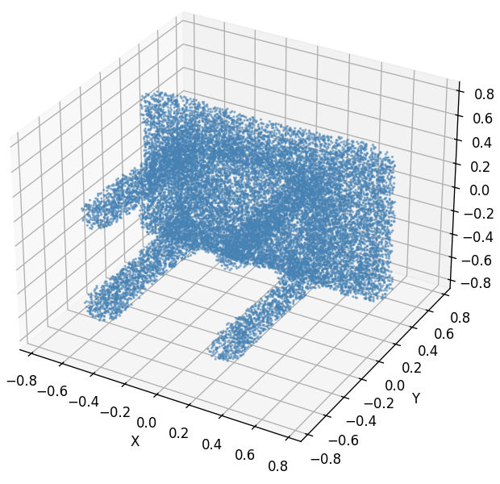 |

### Latent Space Regularization

The VQ bottleneck significantly improves latent space structure. Shapes of the same category share consistent discrete code patterns, while inter-class boundaries are clearly separable.

| Model | Silhouette Coefficient ↑ |
|---|---|
| Baseline DeepSDF | 0.0522 |
| **Generative DeepSDF** | **0.1298** |

| Ground Truth Samples | Discrete Latent Code Heatmap |
|:---:|:---:|
| 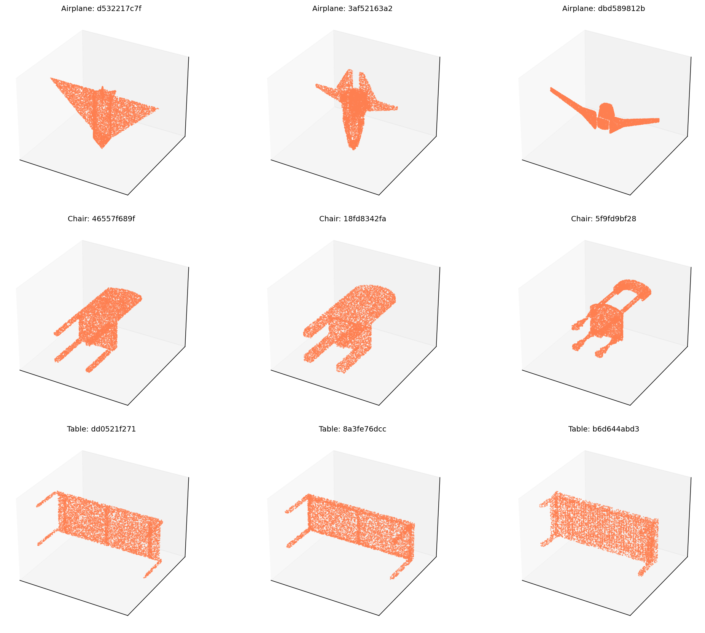 | 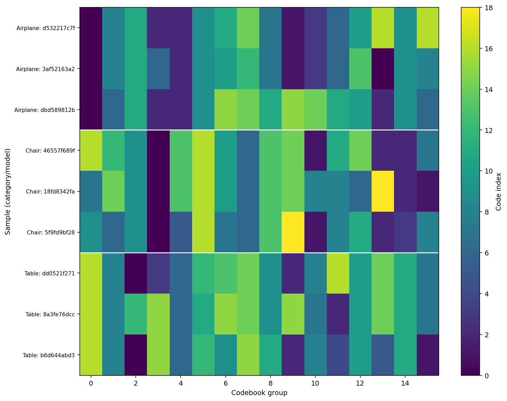 |

### Generative Quality

The AR Transformer prior samples valid combinations of discrete geometric features, far outperforming random Gaussian sampling from the unconstrained baseline latent space.

| Generation Method | MMD ↓ |
|---|---|
| Baseline (Random Gaussian Sampling) | 0.3282 |
| **Generative DeepSDF (AR Prior)** | **0.1046** |

**Baseline (Random Gaussian Sampling):**

| | | |
|:---:|:---:|:---:|
| 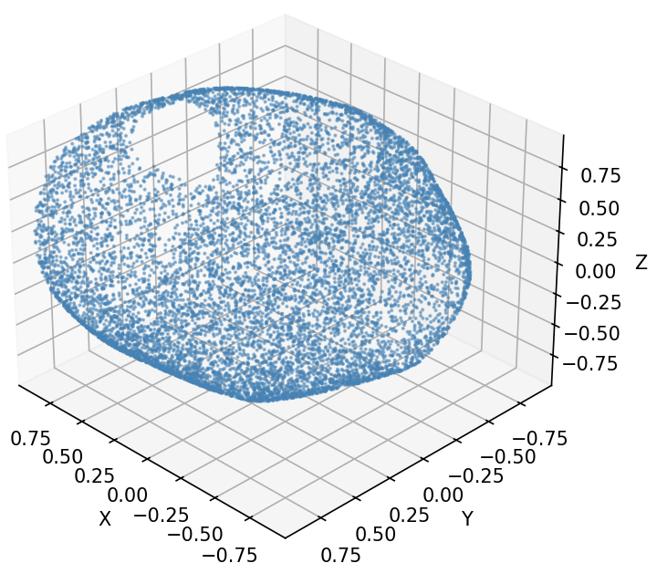 | 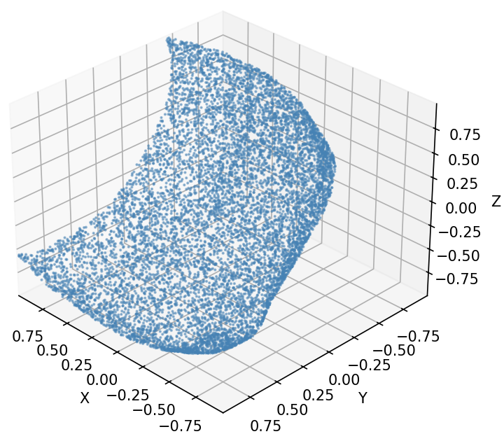 | 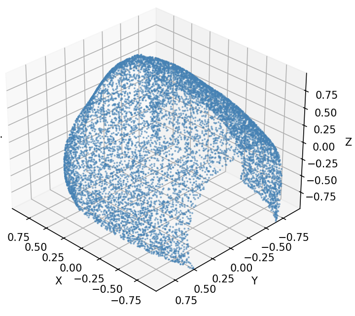 |

**Generative DeepSDF (AR Prior):**

| | | |
|:---:|:---:|:---:|
| 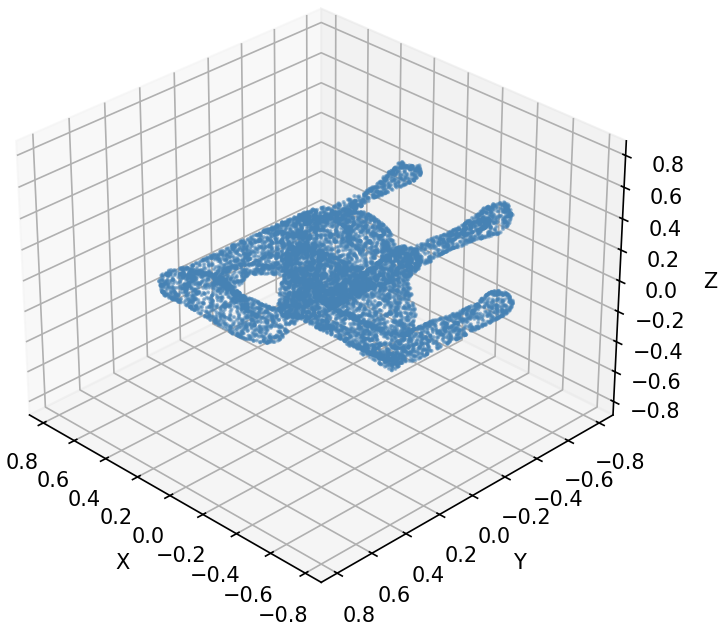 | 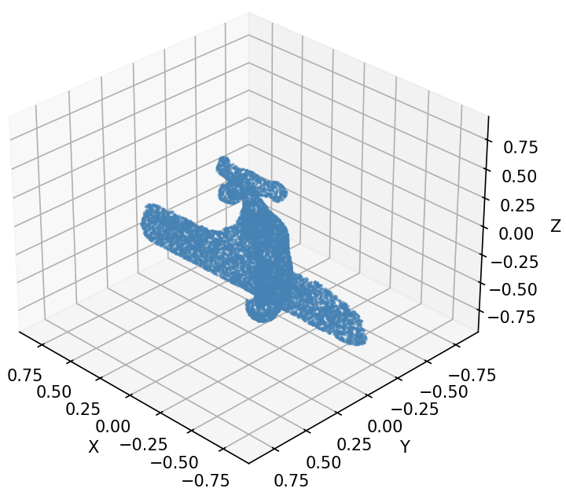 | 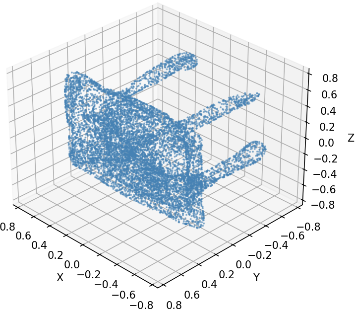 |

## Prerequisites

Before getting started, ensure you have the following installed:
- **Conda** (Miniconda or Anaconda) - for environment management
- **Git** - for cloning the repository
- **NVIDIA CUDA 12.1+** (recommended) - for GPU acceleration with PyTorch
- **HuggingFace API Token** - to access the ShapeNet dataset (get one at https://huggingface.co/settings/tokens)

## Setup Instructions

### 1. Clone the Repository

```bash
git clone https://github.com/Ardacandra/ai6131_3d_deep_learning_final_project.git
cd ai6131_3d_deep_learning_final_project
```

### 2. Set Up the Conda Environment

```bash
# Create a new conda environment with Python 3.9
conda create -n ai6131_3d_deep_learning_final_project python=3.9 -y

# Activate the environment
conda activate ai6131_3d_deep_learning_final_project

# Install PyTorch with CUDA 12.1 support for GPU acceleration
conda install pytorch torchvision torchaudio pytorch-cuda=12.1 -c pytorch -c nvidia -y

# Install all other project dependencies from requirements.txt
pip install -r requirements.txt
```

### 3. Configure HuggingFace Authentication

The ShapeNet dataset is hosted on HuggingFace, so you need to provide your access token:

1. **Create a `.env` file** by copying the example template:
   ```bash
   cp .env.example .env
   ```

2. **Add your HuggingFace token** to the `.env` file:
   - Get your token from https://huggingface.co/settings/tokens
   - Open `.env` in a text editor and set:
     ```
     HF_TOKEN=your_token_here
     ```

### 4. Project Configuration

All project-wide settings are centralized in **`config.py`**. To customize settings, simply edit `config.py` and the changes will be applied across all scripts automatically.

### 5. Download and Prepare the Dataset

Download the ShapeNet dataset locally. This script uses your HF token to authenticate with HuggingFace:

```bash
python prepare_dataset.py
```

The dataset will be downloaded to `./data/shapenet_v2_subset/`. Unzip them with the following script:

```bash
cd ./data/shapenet_v2_subset
for f in *.zip; do unzip "$f"; done
cd ../..
```

### 6. Explore and Visualize the Dataset

To understand how 3D objects are represented in the dataset and visualize sample models, run the visualization script:

```bash
python -m visualization.visualize_dataset
```

## Data Preprocessing for DeepSDF

The preprocessing pipeline implements the methodology from the DeepSDF paper (Park et al., CVPR 2019), with a geometry-aware SDF labelling step to better preserve thin structures, openings, and holes:

- **Object Selection** — Iterate candidate meshes per category until `objects_per_category` successful preprocesses are reached, skipping failed meshes
- **Mesh Normalization** — Scale each mesh to a unit sphere (centroid at origin, longest radius = 1)
- **Oriented Surface Sampling** — Sample surface points with face normals oriented via majority-vote across 100 virtual camera viewpoints, plus a global radial alignment sanity check to enforce outward orientation
- **Near-Surface Samples** — Offset each surface point along its oriented normal by a scalar drawn from one of two Gaussians (σ² = `surface_variance_primary` or `surface_variance_secondary`); the signed offset distance is used directly as the SDF value
- **Random Spatial Samples** — Uniformly sample from the bounding cube for broad spatial coverage
- **SDF Sign Estimation** — Compute SDF for random spatial samples via weighted local normal-projection voting; flag ambiguous points (near-zero weighted projection, or low vote consensus below `sign_vote_consensus_threshold`) and resolve with a three-tier fallback: `mesh.contains()` for watertight meshes, positive (outside) bias for points farther than `far_field_distance_threshold` from the surface, or nearest-neighbor projection for remaining close ambiguous points
- **Output** — Save as NPZ with separate `pos` (outside, SDF ≥ 0) and `neg` (inside, SDF < 0) sample arrays

### Running the Preprocessing

```bash
python prepare_deepsdf.py
```

Each output `sdf.npz` file contains:
- **pos**: Positive SDF samples (outside the mesh) - shape: (N, 4) [x, y, z, sdf_value]
- **neg**: Negative SDF samples (inside the mesh) - shape: (M, 4) [x, y, z, sdf_value]

## DeepSDF Training

### Overview

The training loop follows the original DeepSDF autodecoder procedure:
- **Latent codes per shape** - an embedding table is optimized alongside the decoder
- **Scene-wise sampling** - sample `samples_per_scene` points per shape
- **Clamping** - clamp both targets and predictions to `clamp_dist`
- **Reconstruction loss** - clamped L1 (MAE) between predicted and ground-truth SDF values
- **Code regularization** - latent code norm penalty with warm-up
- **Split batches** - optional `batch_split` to fit memory

### Running Training

**Basic usage (uses defaults from `config.py`):**

```bash
python -m src.deepsdf.train
```

**Custom data root and hyperparameters:**

```bash
python -m src.deepsdf.train ./data/shapenet_sdf \
   --latent-size 64 \
   --hidden-size 256 \
   --epochs 50 \
   --batch-points 2048 \
   --save-dir ./out/deepsdf
```

## DeepSDF Evaluation

The evaluation script measures the quality of the trained DeepSDF model by comparing reconstructed meshes against ground truth meshes from the dataset. Five key metrics are computed:

1. **Chamfer Distance (Mean and Median)**
2. **Earth Mover's Distance (Mean and Median)**
3. **Mesh Accuracy @ 90%**
4. **Silhouette Score (Latent Manifold)**
5. **Davies-Bouldin Index (Latent Manifold)**

### Running Evaluation

```bash
python -m src.deepsdf.evaluate
```

## DeepSDF Output Visualization

**Visualize 5 random shapes:**

```bash
python -m visualization.visualize_deepsdf
python -m visualization.visualize_deepsdf --pointcloud
```

## VQ-DeepSDF

VQ-DeepSDF replaces the continuous per-shape latent codes of the baseline with a **grouped vector-quantized** bottleneck (`GroupedVectorQuantizer` in `src/deepsdf_vq/quantizer.py`). Each shape latent is quantized into `num_codebooks` discrete codes drawn from a shared codebook, enabling a compact discrete shape representation.

### Overview

- **Same decoder architecture** as baseline DeepSDF
- **Quantized latents** — shape embeddings are snapped to the nearest codebook entry per group before being passed to the decoder
- **Three-part loss** — reconstruction (clamped L1) + commitment loss + codebook loss, with an optional entropy regularization term
- **Same SDF data** — uses the same `./data/shapenet_sdf/` NPZ files produced by `prepare_deepsdf.py`

Default VQ settings (in `config.py`): `num_codebooks=16`, `codebook_size=512`, `code_dim=16`, `latent_size=256` (`num_codebooks × code_dim`).

### Running VQ-DeepSDF Training

```bash
python -m src.deepsdf_vq.train
```

### Running VQ-DeepSDF Evaluation

Computes the same five metrics as the baseline evaluation:

```bash
python -m src.deepsdf_vq.evaluate
```

### VQ-DeepSDF Output Visualization

In addition to mesh/point-cloud reconstructions, this script also produces codebook usage bar charts, a shape × codebook-group index heatmap, and training loss curves:

```bash
python -m visualization.visualize_deepsdf_vq
python -m visualization.visualize_deepsdf_vq --pointcloud
```

## Generative Prior (AR Transformer)

A lightweight 3-layer causal Transformer (`src/deepsdf_vq/prior.py`) trained over the discrete VQ token sequences to enable novel shape synthesis. The auto-decoder and codebooks are frozen; only the prior is trained via cross-entropy next-token prediction.

### Training

```bash
python -m src.deepsdf_vq.train_prior
```

Checkpoints saved to `out/deepsdf_vq_prior/`.

### Generative Evaluation (MMD / Coverage)

Samples shapes from the prior, reconstructs them via the frozen decoder, and computes MMD-CD, COV-CD, MMD-EMD, COV-EMD against the training reference set. Generated shapes are also saved as PNG renders.

```bash
python -m src.deepsdf_vq.evaluate_prior
```

Results saved to `out/deepsdf_vq_prior/prior_evaluation_results.json`. Pass `--no-png` to skip rendering.

## References

### DeepSDF

**Park et al., "DeepSDF: Learning Continuous Signed Distance Functions for Shape Representation"** (CVPR 2019)

### ShapeNet Dataset

**Chang et al., "ShapeNet: An Information-Rich 3D Model Repository"** (arXiv:1512.02101, 2015)